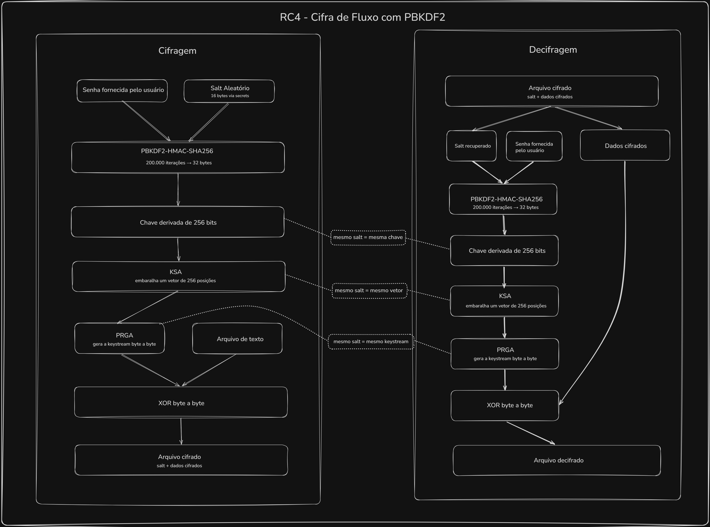

# RC4 — Cifra de Fluxo com PBKDF2

Trabalho da disciplina **Segurança de Sistemas – 2026/1**  
Instituto Federal do Rio Grande do Sul — Campus Canoas

---

## Sobre o algoritmo

O **RC4** (Rivest Cipher 4) é uma cifra de fluxo simétrica criada por Ron Rivest em 1987.  
Ele opera gerando um keystream pseudoaleatório que é combinado com os dados originais via operação XOR byte a byte. Por ser simétrico, a mesma operação serve tanto para cifrar quanto para decifrar, desde que a mesma chave seja usada.

O algoritmo é composto por duas etapas internas:

### KSA — Key Scheduling Algorithm

Inicializa um vetor de estado `S` com 256 posições em ordem crescente `[0, 1, 2, ..., 255]` e o embaralha usando a chave fornecida:

```
S = [0, 1, 2, ..., 255]
j = 0
para i de 0 a 255:
    j = (j + S[i] + chave[i % tamanho_chave]) mod 256
    troca S[i] com S[j]
```

Ao final, `S` é uma permutação dos 256 valores determinada pela chave.

### PRGA — Pseudo-Random Generation Algorithm

Percorre o vetor `S` gerado pelo KSA produzindo um byte do keystream por iteração:

```
i = 0, j = 0
para cada byte dos dados:
    i = (i + 1) mod 256
    j = (j + S[i]) mod 256
    troca S[i] com S[j]
    emite S[(S[i] + S[j]) mod 256]
```

### XOR — Cifragem e decifragem

Cada byte do arquivo é combinado com o byte correspondente do keystream:

```
saída[n] = entrada[n] XOR keystream[n]
```

Como `0 XOR 1 XOR 1 = 0`, aplicar a operação duas vezes com o mesmo keystream recupera o original.

---

## Melhoria implementada: PBKDF2-HMAC-SHA256

O RC4 original usa a senha diretamente como chave, o que o torna vulnerável a senhas fracas e ataques de dicionário. Este script aplica **PBKDF2-HMAC-SHA256** antes de passar a chave ao KSA:

- **Salt aleatório de 16 bytes** gerado a cada cifragem via `secrets.token_bytes()`
- **200.000 iterações** de SHA-256 (key stretching — recomendação NIST)
- **Chave derivada de 32 bytes (256 bits)** passada ao KSA

Isso garante que:

- Senhas fracas sejam fortalecidas computacionalmente
- Duas cifragens com a mesma senha produzam saídas diferentes (salt único)
- Ataques de dicionário e rainbow table sejam inviáveis

O salt é armazenado nos **primeiros 16 bytes** do arquivo cifrado para ser recuperado na decifragem.

### Formato do arquivo cifrado

```
[ 16 bytes de salt ][ restante: dados cifrados com RC4 ]
```

### Fluxo completo



---

## Requisitos

- Python 3.12 ou superior
- Sem dependências externas (apenas biblioteca padrão)

---

## Como executar

```bash
# Cifragem
python rc4.py <arquivo.txt> <chave> criptografar

# Decifragem
python rc4.py <arquivo_cifrado.txt> <chave> decriptografar
```

## Nomenclatura dos arquivos

| Operação       | Entrada            | Saída                |
| -------------- | ------------------ | -------------------- |
| Criptografar   | `nome.txt`         | `nome_cifrado.txt`   |
| Decriptografar | `nome_cifrado.txt` | `nome_decifrado.txt` |

---

## Tratamento de erros

O script valida todas as entradas antes de executar e encerra com mensagem de erro nos seguintes casos:

| Situação                                            | Mensagem                                                               |
| --------------------------------------------------- | ---------------------------------------------------------------------- |
| Número de argumentos inválido                       | `Erro: número de argumentos inválido.`                                 |
| Operação diferente de criptografar/decriptografar   | `Erro: operação '...' inválida.`                                       |
| A rquivo não encontrado                             | `Erro: arquivo '...' não encontrado.`                                  |
| Arquivo sem extensão .txt                           | `Erro: o arquivo deve ter extensão .txt`                               |
| Arquivo para decifrar não termina em `_cifrado.txt` | `Erro: para decriptografar, o arquivo deve terminar em '_cifrado.txt'` |
| Senha vazia                                         | `Erro: a chave não pode ser vazia.`                                    |

---

## Estrutura do código

```
rc4.py
├── ksa(key)              # Key Scheduling Algorithm
├── prga(S, data_len)     # Pseudo-Random Generation Algorithm
├── rc4_process(key, data)# Aplica KSA + PRGA + XOR
├── derive_key(password, salt) # Derivação de chave com PBKDF2
├── criptografar(caminho, senha)   # Lê, cifra e salva o arquivo
├── decriptografar(caminho, senha) # Lê, decifra e salva o arquivo
├── validar_entradas(args)         # Valida e parseia os argumentos
└── main()                         # Ponto de entrada
```

---

## Uso de Inteligência Artificial Generativa

Em conformidade com a **Instrução Normativa nº 16/2026 do IFRS** (GAB-REI, 26/05/2026), declaro o uso de ferramenta de Inteligência Artificial Generativa no desenvolvimento deste trabalho.

| Item                         | Detalhe                                                                                                                    |
| ---------------------------- | -------------------------------------------------------------------------------------------------------------------------- |
| **Ferramenta utilizada**     | Claude (Anthropic) — modelo Claude Sonnet 4.6                                                                              |
| **Partes assistidas por IA** | Geração inicial do código `cripto.py`, estrutura do README e explicações sobre o funcionamento do algoritmo                |
| **Revisão humana**           | Todo o conteúdo gerado foi revisado, compreendido e validado pelo autor, incluindo testes manuais de cifragem e decifragem |
| **Responsabilidade**         | O autor assume integral responsabilidade pelo conteúdo entregue, conforme Art. 4º da IN nº 16/2026                         |

---

## Referências bibliográficas

**Sobre o algoritmo RC4:**

SCHNEIER, B. **Applied Cryptography: Protocols, Algorithms, and Source Code in C**. 2. ed. New York: John Wiley & Sons, 1996.

PAAR, C.; PELZL, J. **Understanding Cryptography: A Textbook for Students and Practitioners**. Berlin: Springer, 2010. Disponível em: <https://link.springer.com/book/10.1007/978-3-642-04101-3>. Acesso em: 11 jun. 2026.

FLUHRER, S.; MANTIN, I.; SHAMIR, A. Weaknesses in the Key Scheduling Algorithm of RC4. In: **Selected Areas in Cryptography**, 2001. Lecture Notes in Computer Science, v. 2259, p. 1–24. Springer, Berlin, Heidelberg. Disponível em: <https://link.springer.com/chapter/10.1007/3-540-45537-X_1>. Acesso em: 09 jun. 2026.

ALBINI, L. C. P. **Tutorial de Criptografia**. Universidade Federal do Paraná, Departamento de Informática. Disponível em: <https://www.inf.ufpr.br/albini/tutorial_cripto/index.html>. Acesso em: 11 jun. 2026.

KALISKI, B. **PKCS #5: Password-Based Cryptography Specification Version 2.0**. RFC 2898. Internet Engineering Task Force (IETF), 2000. Disponível em: <https://www.rfc-editor.org/rfc/rfc2898>. Acesso em: 11 jun. 2026.

NATIONAL INSTITUTE OF STANDARDS AND TECHNOLOGY (NIST). **Recommendation for Password-Based Key Derivation — Part 1: Storage Applications**. NIST Special Publication 800-132. Gaithersburg, MD: NIST, 2010. Disponível em: <https://doi.org/10.6028/NIST.SP.800-132>. Acesso em: 10 jun. 2026.

PYTHON SOFTWARE FOUNDATION. **hashlib — Secure hashes and message digests**. Python 3 Documentation. Disponível em: <https://docs.python.org/3/library/hashlib.html>. Acesso em: 11 jun. 2026.

PYTHON SOFTWARE FOUNDATION. **secrets — Generate secure random numbers for managing secrets**. Python 3 Documentation. Disponível em: <https://docs.python.org/3/library/secrets.html>. Acesso em: 11 jun. 2026.

---
